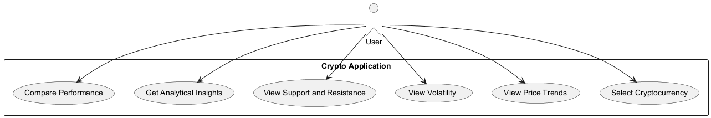
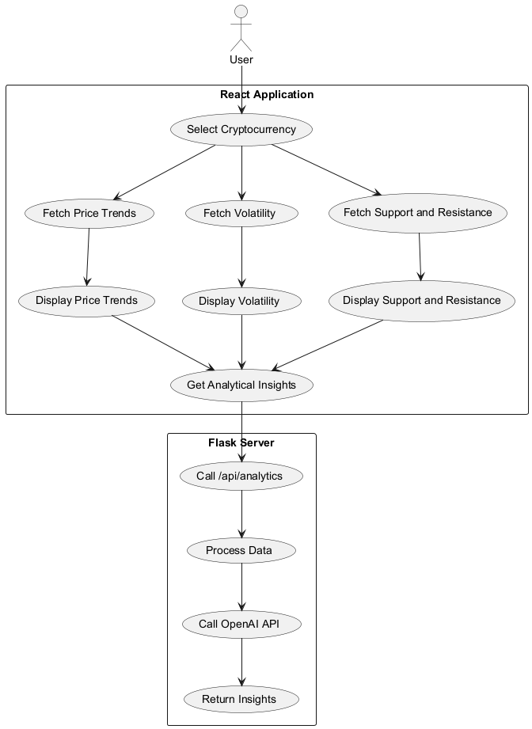
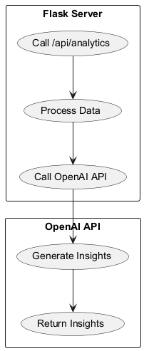
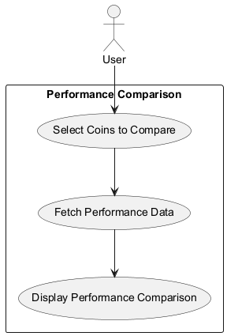

# Overview

The Crypto Intelligence Application is a comprehensive platform designed to provide users with insights into cryptocurrency trends, volatility, support and resistance levels, and performance comparisons. The application leverages a React frontend for user interaction and a Flask backend for data processing and integration with the OpenAI API to generate analytical insights. This documentation outlines the architecture, components, and interactions within the system.

# Architectural Design

The architecture of the Crypto Intelligence Application consists of two main components: the **React Application** and the **Flask Server**. The following diagrams illustrate the interactions and data flow between these components.
## 

 

**Description**: 
This diagram illustrates the primary use cases for the user within the Crypto Application. Users can select a cryptocurrency, view its price trends, volatility, support and resistance levels, obtain analytical insights, and compare the performance of different cryptocurrencies.

 

**Description**: 
This diagram illustrates the interactions between the React Application and the Flask Server. The React Application sends user requests to the Flask Server, which processes the data and calls the OpenAI API to generate insights. The insights are then returned to the React Application for display to the user.

 

**Description**: 
This diagram illustrates the interaction between the Flask Server and the OpenAI API. The Flask Server processes the data and calls the OpenAI API to generate insights. The insights are then returned to the Flask Server for display to the user.

 

**Description**: 
This diagram illustrates the interaction between the React Application and the Flask Server for performance comparison. The React Application sends user requests to the Flask Server, which processes the data and calls the OpenAI API to generate insights. The insights are then returned to the React Application for display to the user.

**Component Interactions**:

1. **User**: The user interacts with the React Application to select a cryptocurrency, view its price trends, volatility, support and resistance levels, obtain analytical insights, and compare the performance of different cryptocurrencies.

2. **React Application**: The React Application is the user interface that allows the user to interact with the system. It sends user requests to the Flask Server to fetch data and insights.

3. **Flask Server**: The Flask Server acts as an intermediary between the React Application and the OpenAI API. It processes the data and calls the OpenAI API to generate insights.

4. **OpenAI API**: The OpenAI API is used to generate analytical insights based on the data processed by the Flask Server.

**Conclusion**:
The Crypto Intelligence Application provides a comprehensive platform for users to explore cryptocurrency trends, volatility, support and resistance levels, and performance comparisons. The architecture ensures efficient data processing and integration with the OpenAI API to deliver accurate and insightful analytics.

This documentation provides a detailed overview of the architecture, components, and interactions within the Crypto Intelligence Application. It ensures that the system is designed to meet the requirements of the user and provides a robust platform for exploring cryptocurrency data and insights.